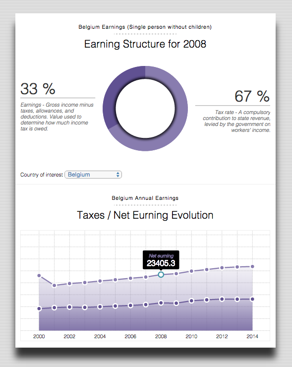

##### Author : Michaël Lambé (mic0331 at gmail dot come)
## Summary
**This project is a second iteration of this project [Eurostat1](https://github.com/mic0331/eurostat).  
In this version, a focus has been placed on the visulization to be explonatory but also and more importantly explanatory.**
### Income tax rate per country
Income tax rates vary hugely between countries and depend highly on other factors like earnings, martial status and so on.

Where in Europe do people pay the highest slice of their earnings to the tax man ?

According to the Eurostat organization, in 2013, a single person on an average salary without children will have the highest income tax rate in Belgium - some 42.1% of his or her earnings. Germany isn't too far behind. Neighbording Danemark comes in third place.

In this [visualization](https://serene-cliffs-1778.herokuapp.com/), noticed the inequalities contributions between countries. Each bar is showing the tax rate per country as a combination of income taxes and employee's social security contribution. Family allowances is not included as we only consider a single person on an average salary without children.
## Initial Design Decision
The **bar chart** at the top of the screen is showing the tax rate per country in an increasing order.  The taxes are a combination of both the income taxes and employee social security therefore a stacked bar chart was the most appropriate to display the information.
In order to reflect the taxes change from year to year, a yearly sequence has been built in order to modify the bar chart.  The user can let the sequence play by itself or he can simply select a year of interest to get more delails.
If he wich, he can also play the sequence again if it has been stoped by simply pushing the "play all years" button.

If the user select a bar on the bar-chart, the **line chart** at the bottom of the screen is showing the selected country as well as the average tax pay in the Euro zone.
By default, if no country are selected, only the average axes is displayed. Notice that the line chart is showing all countries in background with a very light gray.

Some annotations are placed in the line chart to indicate some interesting facts about the data.  
At first, the idea was to highlight the country of interest when an annotation was mouse-hover by the user but finally this idea was rejected because the line chart was too messy (multiple lines of different colors - and a large legend to display).

The data (coming from [Eurostat](http://appsso.eurostat.ec.europa.eu/nui/show.do?dataset=earn_nt_net&lang=en)) are available on a yearly basis therefore, it was making sence to display a multi-line chart to express the taxes history evolution.

For the average line and the selected country line, a mouse over effect is implemented to clearly see the % of rate for a year of interest.

In order to re-inforce the current year of the sequence loop, a vertical line is moving with the sequence inside the line chart so the user always know at which year he is analysing the data.

Finally, compare to the first iteration of the project, notice that a paragraph above all of the charts explaining where the data come from and what it represents has been included.

The next picture show the final version of the visualization.

## Feedback

Feedback details for this second iteration has not been collected.

## Technological choices

*Note: This section is far beyond the scope of the the project, it is intended for reader interested to contribute on the project or just interested to deploy the fullstack solution locally.*

The web-based visualization has been implemented using an API developped for this project.  
The technology used are **mongodb, node.js, python, html (jade template), css and D3.js**.
The mini-project is hosted on [heroku](https://www.heroku.com/) and the database on [mongolab](https://mongolab.com/).  Both cloud solution are offering a free tier ideal for this proof-of-concept type of project.

The project source code folder contain two main area of interest.

1. **Preprocessing**

Source file :
* [taxes.R](https://github.com/mic0331/eurostatV2/blob/master/exploration/taxes.R)
* [preprocessor.py](https://github.com/mic0331/eurostat/blob/master/preprocessing/preprocessor.py)
* [API](https://github.com/mic0331/eurostat/tree/master/server/api/eurostat)
* [index.jade](https://github.com/mic0331/eurostat/blob/master/server/views/index.jade)
* [app.js](https://github.com/mic0331/eurostat/blob/master/public/app/app.js)

This is where the raw data material from [eurostat](http://appsso.eurostat.ec.europa.eu/nui/show.do?dataset=earn_nt_net&lang=en) are stored (`/proprocessing/data/earn_nt_net.tsv`). The python file `preprocessing/preprocessor.py` is used to load the initial data, manipulate them and eventually perform some cleaning.  
The data was initialy coming from a TSV format and they were converted into JSON. `preprocessor.py` is also responsible to upload the data in mongodb where they will be consumed by the webapp.

2. **Webapp**
The root directory contain the webapp developed using the `express.js` framework. The structure of the webapp is very simple to understand.  The folder `server/api` contains endpoints consumed by the webpage.  For this project only the eurostat endpoint is used.  The folder `public` is where the webpage magic is happening.  The core of the implementation of the d3.js logic is in the file `public/app/app.js`.

For the reader interested to run the project locally, he should make sure mongodb, node.js and python3 are installed locally.
Next, NPM package manager should also be installed with the three global 
packages `gulp`, `nodemon`, `browser-sync` and `bower`.

To run the project, follow these steps :

1. Clone the repository

2. Make sure mongodb is running on default port and a db is created with the name `eurostat`.

3. In the folder `proprocessing` run 

    `>>>  python preprocessor.py`
    (will load the data in mongodb)

4. Still in the root folder run the command

    `>>>  npm inslall`
    (will install the local packages needed by the backend)

    `>>>  bower install`
    (will install the local packages needed by the frontend)

    `>>>  nodemon server`
    or
    `>>> node server`
    (this will start the webapp)

5. Navigate to `http://localhost:3030/`

6. The api can be access at `http://localhost:3030/api/v1/ratio`.

7. [OPTIONAL] During the devlopment phase of this project, `browsersync` has been used in order to have immediate feedback on the screen when a code modication was made. To run the project in development mode, simply run :

    `>>> gulp`

Then navigate to `http://localhost:4000/`

## Conclusion
Finding an interesting data set and a story it tells can be the most difficult part of producing an infographic or data visualization.

The first iteration of this project was clearly failing in the "explanatory" part of the visulization.  The process of finding a story and telling it is really something complex to put in place.
I had to spend several days manipulating the data and exploring them using R in order to find something interesting to tell.

The final visualization is clearly better but not as good as I wanted to be.  For example, the annotations in the line chart are telling a story but i would prefer being able to highlight the countries of interest for the annotation.  
Highlithing the country would make the line chart unpleasant to look at.  Several design change would be required in order to make this change possible (increase page width and positioning) unltimately requirering a third version of the project...  

Finally, the `app.js` getting very large and would require some serious refactoring in order to make this project ready for third iteration.  
## Resources
* [Eurostat - Net earnings and tax rates (earn_net)](http://appsso.eurostat.ec.europa.eu/nui/show.do?dataset=earn_nt_net&lang=en)
* [Eurostat - Net earnings and tax rates (metadata)](http://ec.europa.eu/eurostat/cache/metadata/en/earn_net_esms.htm)
* [Very nice visualization where I find lots of inspiration](http://www.nytimes.com/interactive/2013/03/29/sports/baseball/Strikeouts-Are-Still-Soaring.html?ref=baseball&_r=1&)
* [Exploratory vs Explanatory analysis](http://www.storytellingwithdata.com/2014/04/exploratory-vs-explanatory-analysis.html)