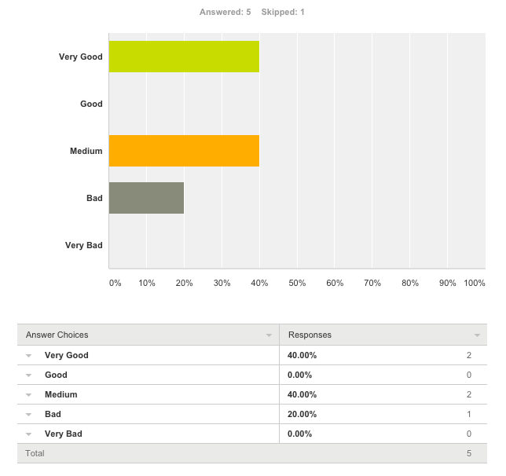
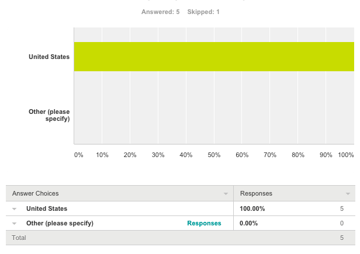

# Feedback consolidation

#1. Survey Monkey
**What do you notice in the visualization?**

This question is very vague, but I guess I notice that the movement of the upper graphic makes it more interesting. It's fun to select different countries.
(6/15/2015 2:22 AM)

It appears to be interactive, which allows me to choose the country of my interest.
(6/14/2015 5:59 PM)

I noticed the 33% and 67% immediately... the donut chart I kind of ignored.
(6/14/2015 5:40 PM)

Poor labelling
(6/14/2015 4:00 PM)

*Conclusion : Out of the mismatch made with the donut chart, the interactivity of the chart has been well appreciated.*

---

**What questions do you have about the data?**

I find myself wondering if this is the average earnings of single people without children or if it is the tax rate paid on the average earnings assuming the earner was single.
(6/15/2015 2:22 AM)

In the United States the tax rate varies with income level. How do you handle this tiered tax rate structure? In the Belgium graph, earnings on the left is at 33%, and tax rate on the right is 67%. This adds to 100%. How do we interpret these numbers? Certainly they don't pay 100% taxes.
(6/14/2015 5:59 PM)

I don't know what it means. Does it mean that in Belgium, 67% of income is paid in taxes to the government and 33% is take home pay? If so, I think it would be useful to make the explanation paragraphs shorter and more concise.
(6/14/2015 5:40 PM)

None
(6/14/2015 4:00 PM)

*Conclusion: The caption used to detail the data were incorrectly selected.  The initial data was available with different family situations but all referring to an average working.  Differences exist with respect to martial status (single vs. married), number of workers (only in the case of couples), number of dependant children, and level of gross earnings.
The data refer to an average worker at national level for different illustrative cases, defined on the basis of marital status (single vs. married), number of workers (only in the case of couples), number of dependent children, and level of gross earnings, expressed as percentage of the average earnings of an average worker (AW).
To simplify things, “single person with no children and 100% of AW” where selected for this visualisation project.*

---

**What relationships do you notice?**

It is interesting to see the different countries, but very difficult to compare countries or notice trends between countries.
(6/15/2015 2:22 AM)

I see two curves in the graph which appear to be related, but don't know what they represent. It appears that the values are increasing uniformly in most cases.
(6/14/2015 5:59 PM)

Truthfully, not much. I would expect to see this data in a normalized bar chart: http://bl.ocks.org/mbostock/3886394
(6/14/2015 5:40 PM)

None. It's too much work clicking on the dropdown and waiting for the results to load.
(6/14/2015 4:00 PM)

*Conclusion: The main message is that people are expecting a better visualisation to compare countries to see trends between, countries.  One suggestion was to used a normalised bar chart.*

---

**What do you think is the main takeaway from this visualization?**

I don't get a takeaway from this graphic. It seems more like a reference where I could look up tax rates.
(6/15/2015 2:22 AM)

I have more questions coming away from this visualization than answers. There needs to be more labeling and explanation to prevent confusion. Perhaps a typical case with breakdown of taxes paid for an individual using the rates in the graph would clear up some questions.
(6/14/2015 5:59 PM)

Taxes are high in Belgium.
(6/14/2015 5:40 PM)

Couldn't find one.
(6/14/2015 4:00 PM)

*Conclusion: The main takeaway from the visualisation is that taxes are clearly not equals from country to country.  Belgium is a perfect example were taxes are high.  Apparently this message is not really reflected correctly.  This is probably due to the nature of the chart.  It is very difficult to compare countries and notice trends between countries.*

---

**Is there something you don’t understand in the graphic?**

Is there a reason only these countries were selected?
(6/15/2015 2:22 AM)

I don't understand how the percentages add at the top of the graph. For example, in the United States graph, do citizens pay state taxes on 89% of their income?
(6/14/2015 5:59 PM)

What is it supposed to show?
(6/14/2015 4:00 PM)

I had some difficulty understanding the descriptions: "Gross income minus taxes, allowances, and deductions. Value used to determine how much income tax is owed." Is this simply the tax rate?
(6/13/2015 3:06 AM)

*Conclusion: Again labelling was not clear making the understanding of the percentages not clear.*

---

**How would you rate the quality of the visualization ?**

---

**Do you have any other comments, questions, or concerns?**

The introductory text seems politically biased towards countries with high social security rates, but then social security contributions are not included in the visualization at all. The three questions that begin the introduction are also not addressed by the visualization. One could perhaps determine where average earners pay the most, but only by clicking on every country and remembering the results.
(6/15/2015 2:22 AM)

First, I think visually the pie chart with large inner radius looks a lot better than most pie charts do, and the dynamic fill-in looks cool. I'm not sure how informative the graphic is versus just a number on the screen, but it certainly looks really professional. It's also helpful and informative to see the time-series graph of how tax rates have changed for a given country. I think it was a good idea to include this. I would suggest adjusting the re-scaling of the y axis: for some countries, the lines are too close to the x axis to be able to interpret them. Also, a y axis label would be helpful. I had fun toggling through various countries, but ultimately found myself wanting to be able to compare two or more countries side-by-side. If you were to continue building this visualization, I would suggest a third panel that allows comparisons in some way. Overall, great job, and good idea to use surveymonkey! cheers,
(6/14/2015 11:17 PM)

The y-axis on the graph is unlabeled, making it useless for determining actual percentages. The title of the graph is misspelled. After seeing the initial graph for Belgium, I selected the United States, and the percentages and messages in the top of the graph seemed to overwrite with additional choices, making this information unreadable. After trying Belgium and then the United States again, this problem went away. Maybe there is some sort of bug with the first choice not clearing the screen.
(6/14/2015 5:59 PM)

Definitely impressed by the reactive features... graphs and %'s change when you select new country. It's definitely hard to compare countries in this design pattern. Thanks for sharing!
6/14/2015 5:40 PM View respondent's answers
What, exactly, is it that you are trying to show? There is no y-axis on the line graphs.
(6/14/2015 4:00 PM)

Eurning should be Earning! I enjoy the color theme and the dynamic effects. In the bottom line chart, it would be helpful to have clear labels on the y-axis. The line chart overall is aesthetically pleasing but there is some clarification needed around each of the variables plotted.
(6/13/2015 3:06 AM)

*Conclusion: There a lot of good feedback in this section. 
1/ the introductory text is not really appropriate for the visualisation.  As pointed, the text is not perfectly in relation with the charts.  The charts are missing fundamental elements such as social security contributions.
2/ the y-axis has been mentioned several times as a key missing element of the visualisation.  
3/ there are many instances of typos in the labels...* 

---

**In what country do you currently reside?**

*Conclusion: Only US residents took the survey.  I would appreciate get feedback from people in Europe especially because the data was primarily targeted for euro citizens.*

---

#2. Google +

**14/06/2015**
The labels are reversed in the upper graphic.  Currently, taxes are larger than earnings.  There is no y-axis label in the lower graph, and the shading doesn't indicate clearly enough what the two lines represent.  I also missed what earnings were being compared: is it the median income in each country? Some constant number of dollars or Euros? 

(comment by myself : I made some simple changes based on your feedback.  Hope they are making the visualisation much interesting. Are you sure the y-axis will not make the chart too busy? If you hover the circles you can see the value.)

The changes have certainly improved the graphic.   I think that the y-axis needs a label because the upper graphic shows percentage, but the lower graphic is Euros.  Labels would also make it clear whether the different countries were plotted on the same scale.  Also, in the main title, did you really use average earnings?  Most studies compare median earnings.  Finally, "Earnings" is misspelled in the lower chart's title. 

*Conclusion: A missmatch was introduced in the initial version fo the chart.  The donuts chart at the top was showing a split of the area labels.*

---

**14/06/2015**
Small typo when hovering over the lower graph's data points...reads 'Net eurning' 

---

#3. Direct email

I like what you’ve got so far, but I have some ideas that I think might make your visualization better.

Firstly, the visualization is titled “<Country> Average Earnings” but I don’t actually see a number there for average earnings. I see taxes percentage and net percentage, but no absolute numbers. What is the average earnings in the country I’ve selected?

Second, the line graph on the bottom should have labels on the y axis. Is one of the lines a percentage and the other an absolute value? I’m not sure what units these lines are in.

I think those two changes would make a big difference.

(I also note that “Taxes / Net Eurning Evolution” is misspelled. If I may guess that English is not your native language, I would suggest “Taxes / Average Net Earnings History” instead.)

Good job!

---